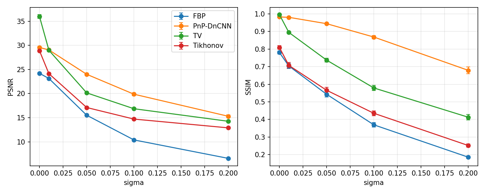
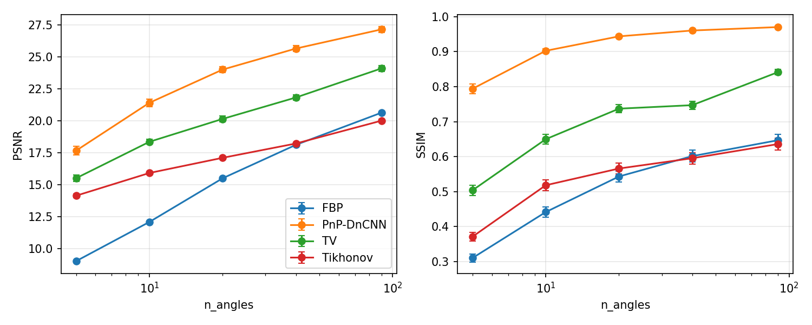

# Learned Regularization for Robust Image Reconstruction
### Sparse-view CT reconstruction with a Plug-and-Play learned prior

## 1. Problem and methods

We study sparse-view computed tomography as a linear inverse problem
y = A x + n, where A is a sparse-angle Radon transform (few projection
angles), x is a 28x28 image, and n is additive Gaussian noise. A is
formed explicitly as a dense matrix, giving an exact adjoint A^T, which
is used both for the classical solvers below and for the learned
proximal-gradient scheme.

**Baselines (classical regularization):**
- Filtered back-projection (FBP)
- Tikhonov / L2 regularization (closed form)
- Total variation (TV), solved with ADMM

**Learned prior:** a noise-level-conditioned DnCNN denoiser D_sigma,
trained once on clean MNIST digits with Gaussian noise sigma in
[0, 0.3], used as an implicit prior inside a Plug-and-Play
proximal-gradient (PnP-PGD) iteration:

    x_{k+1} = D_{sigma_d}( x_k - eta * A^T(A x_k - y) ),   eta = 1 / L(A^T A)

All hyperparameters (Tikhonov lambda, TV lambda, PnP sigma_d and number
of iterations) are tuned by grid search on a held-out validation split,
separately for each experimental condition unless stated otherwise, and
then evaluated on a disjoint test split. Metrics are PSNR and SSIM,
reported as mean and 95% CI over test images, plus a paired Wilcoxon
signed-rank test between PnP and TV on matched images and noise
realizations.

## 2. In-distribution accuracy (E1: noise, E2: angles)

TV is a strong baseline on MNIST because digits are close to piecewise
constant. PnP overtakes it as soon as the problem is genuinely
ill-posed:

| Condition | FBP | Tikhonov | TV | PnP-DnCNN | PnP - TV |
|---|---|---|---|---|---|
| sigma=0, 20 angles | 24.2 | 28.9 | **36.0** | 29.6 | -6.4 dB |
| sigma=0.01, 20 angles | 23.1 | 24.1 | 29.0 | 29.1 | +0.07 dB (n.s., p=0.27) |
| sigma=0.05, 20 angles | 15.5 | 17.1 | 20.2 | **24.0** | +3.85 dB (p<1e-30) |
| sigma=0.1, 20 angles | 10.4 | 14.7 | 16.9 | **19.9** | +3.0 dB (p<1e-30) |
| sigma=0.2, 20 angles | 6.6 | 12.9 | 14.3 | **15.3** | +1.0 dB (p<1e-10) |
| 5 angles, sigma=0.05 | 9.1 | 14.2 | 15.5 | **17.7** | +2.15 dB (p<1e-25) |
| 90 angles, sigma=0.05 | 20.6 | 20.0 | 24.1 | **27.1** | +3.04 dB (p<1e-30) |

(PSNR in dB, test set, best hyperparameters per method and condition.
Full grid in `results/summary_table.md`; all values reproducible via
`run_baselines.py`, `run_pnp.py`, `make_plots.py`.)

**Finding 1.** The learned prior gives a large, statistically
significant improvement over TV whenever the problem is genuinely
under-determined or noisy (few angles, or sigma >= 0.05): up to +4 dB
PSNR and a jump in SSIM from ~0.74 to ~0.94 at sigma=0.05. In the
near-noiseless, well-posed regime TV wins clearly (-6.4 dB), because
its assumption (piecewise-constant images) is closer to exact for
MNIST digits than the CNN prior's implicit assumption.


**Figure: PSNR and SSIM vs. measurement noise (20 angles).** TV leads
at low noise (sigma <= 0.01); PnP-DnCNN overtakes all classical
baselines from sigma = 0.05 upward. Error bars: 95% CI over 200 test
images.


**Figure: PSNR and SSIM vs. number of projection angles (sigma=0.05).**
PnP-DnCNN leads across the entire range tested, with the largest
relative advantage under the most severe angular undersampling (5
angles). Error bars: 95% CI over 200 test images.

## 3. Why so few PnP iterations? (E5 ablation)

Validation tuning consistently selects very few PnP iterations
(5-25 depending on the condition). The convergence study
(`fig_convergence.png`, 50 test images, sigma_d in {0.02, 0.05, 0.1, 0.2},
400 iterations) shows why: PSNR rises quickly, **peaks around iteration
5-15, and then decays to a lower plateau** (e.g. sigma_d=0.1: peak
~24.0 dB near iteration ~10, plateau ~22.0 dB by iteration 400).
Simultaneously the data-fidelity residual ||A x_k - y|| does *not*
decrease with iteration; it rises and plateaus, more so for larger
sigma_d.

**Finding 2.** This PnP-PGD scheme does not converge to a fixed point
that is both data-consistent and maximally accurate. The CNN denoiser
has no non-expansiveness guarantee, so continued iteration trades data
fidelity for an increasingly strong (and increasingly biased) prior
pull. Early stopping is therefore not a tuning artifact but a
necessary, active part of the regularization; this is consistent with
know limitations of PnP methods using unconstrained deep denoisers
(Ryu et al. 2019 and related PnP-convergence literature discuss this
trade-off explicitly).

## 4. Forward-model mismatch (E3)

Data are generated with the true 20-angle operator; reconstruction
uses a wrong operator with either a constant angle offset (rigid
mis-registration) or per-angle random jitter, up to 4 degrees.
Hyperparameters are frozen at their nominal (sigma=0.05, 20-angle)
values, not re-tuned per mismatch level.

- Under a 4-degree constant offset, PnP loses 4.0 dB (24.0 -> 20.0)
  while TV loses only 1.6 dB (20.2 -> 18.6). PnP's advantage over TV
  shrinks from +3.85 dB to +1.48 dB, but never disappears in this range.
- Under random per-angle jitter of the same magnitude, both methods
  degrade less (PnP: 24.0 -> 22.2; TV: 20.2 -> 19.2), and PnP remains
  clearly ahead.

**Finding 3.** The learned prior is more sensitive to systematic
(rigid) forward-model error than TV is, even though it remains more
accurate in absolute terms over the tested range. A plausible
explanation is that PnP produces sharper, more confidently-placed
edges, which are penalized more by geometric misregistration than a
smoother TV reconstruction; this is a hypothesis, not something
independently verified here.

## 5. Distribution shift (E4)

The denoiser is trained only on MNIST digits. At test time the same
frozen pipeline (sigma=0.05, 20 angles) is applied to Fashion-MNIST,
EMNIST letters, and the Shepp-Logan phantom (single image, 20 noise
draws).

| Test set | TV | PnP-DnCNN | PnP - TV |
|---|---|---|---|
| MNIST (in-distribution) | 20.3 | **24.0** | +3.7 dB |
| EMNIST letters (near-shift) | 20.1 | **22.0** | +1.9 dB |
| Fashion-MNIST (far-shift) | **19.6** | 16.5 | -3.1 dB |
| Shepp-Logan phantom (far-shift) | **19.2** | 15.0 | -4.2 dB |

**Finding 4.** The prior generalizes to EMNIST letters, which share
digits' stroke-like statistics, but fails on Fashion-MNIST and the
Shepp-Logan phantom, both structurally unlike digits. `fig_shift_grid.png`
shows *how* it fails: not as generic blur, but as hallucinated
digit/stroke-like structure imposed on shoe textures and on the
phantom's interior, which is a more concerning failure mode than
graceful degradation, since the output can look confidently
structured while being wrong. This is the central limitation of the
project and the main argument for out-of-distribution testing of any
learned prior before deployment.

## 6. Limitations

- Trained and evaluated at small scale (28x28 MNIST-derived images);
  trends may not transfer directly to natural-image or clinical CT
  resolution and geometry.
- Same forward operator used to generate and (in E1/E2/E4) reconstruct
  data ("inverse crime"); E3 partially addresses this via mismatch.
- A single trained denoiser instance; significance tests are over test
  images for one training run, not over independent retrainings.
- The PnP scheme has no convergence guarantee, and behaves accordingly
  (Section 3); results depend on early stopping being tuned correctly.
- Mismatch levels tested (angle error up to 4 degrees) are moderate;
  larger or structurally different mismatches were not tested.

## 7. Reproducing

```
pip install -r requirements.txt
python train_denoiser.py --epochs 8
python run_baselines.py --exp noise && python run_baselines.py --exp angles
python run_pnp.py --exp noise && python run_pnp.py --exp angles
python make_plots.py --exp noise && python make_plots.py --exp angles
python run_robustness.py --exp mismatch && python run_robustness.py --exp shift
python make_figures.py
python make_summary.py
```
